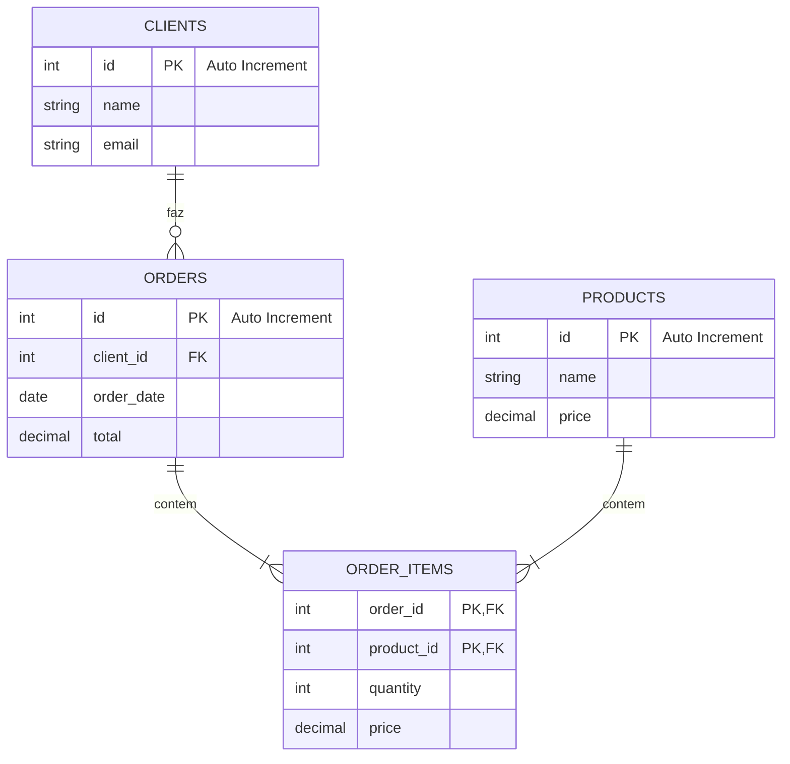

# Exercícios de MySQL

## Estrutura do Banco de dados

Este diagrama exemplifica como funciona a estrutura do banco de dados, poderá servir de guia para o desenvolvimento das atividades.

## Exercício 1 - Fácil

1. Crie a tabela `CLIENTS` com as seguintes colunas:

    - `id`: inteiro, chave primária, auto incrementável
    - `name`: texto, não nulo
    - `email`: texto, não nulo

## Exercício 2 - Fácil

2. Crie a tabela `PRODUCTS` com as seguintes colunas:
    - `id`: inteiro, chave primária, auto incrementável
    - `name`: texto, não nulo
    - `price`: decimal, não nulo

## Exercício 3 - Médio

3. Crie a tabela `ORDERS` com as seguintes colunas:
    - `id`: inteiro, chave primária, auto incrementável
    - `client_id`: inteiro, chave estrangeira referenciando `CLIENTS(id)`
    - `order_date`: data, não nulo
    - `total`: decimal, não nulo

## Exercício 4 - Médio

4. Crie a tabela `ORDER_ITEMS` com as seguintes colunas:
    - `order_id`: inteiro, chave estrangeira referenciando `ORDERS(id)`
    - `product_id`: inteiro, chave estrangeira referenciando `PRODUCTS(id)`
    - `quantity`: inteiro, não nulo
    - `price`: decimal, não nulo

## Exercício 5 - Fácil

5. Insira dados nas tabelas `CLIENTS` e `PRODUCTS`.

## Exercício 6 - Médio

6. Insira dados na tabela `ORDERS`.

## Exercício 7 - Médio

7. Insira dados na tabela `ORDER_ITEMS`.

## Exercício 8 - Difícil

8. Atualize o preço de um produto na tabela `PRODUCTS` e todos os registros relacionados na tabela `ORDER_ITEMS`.

## Exercício 9 - Fácil

9. Delete um cliente e todos os pedidos relacionados.

## Exercício 10 - Médio

10. Altere a tabela `CLIENTS` para adicionar uma coluna de data de nascimento (`birthdate`).

## Exercício 11 - Médio

11. Faça uma consulta usando JOIN para listar todos os pedidos com os nomes dos clientes e os nomes dos produtos.

## Exercício 12 - Difícil

12. Faça uma consulta usando LEFT JOIN para listar todos os clientes e seus pedidos, incluindo clientes sem pedidos.

## Exercício 13 - Difícil

13. Faça uma consulta usando RIGHT JOIN para listar todos os produtos e os pedidos que os contêm, incluindo produtos que não foram pedidos.

## Exercício 14 - Médio

14. Utilize funções de agregação para obter o total de vendas e a quantidade total de itens vendidos.

## Exercício 15 - Médio

15. Faça uma consulta para listar todos os clientes e a quantidade total de pedidos realizados por cada um, ordenados pela quantidade de pedidos em ordem decrescente.

## Exercício 16 - Médio

16. Faça uma consulta para listar todos os produtos e a quantidade total de cada produto vendido, ordenados pela quantidade em ordem decrescente.

## Exercício 17 - Médio

17. Faça uma consulta para listar todos os clientes e o valor total gasto por cada um, ordenados pelo valor gasto em ordem decrescente.

## Exercício 18 - Difícil

18. Faça uma consulta para listar os 3 produtos mais vendidos (em quantidade) e o total de vendas de cada um.

## Exercício 19 - Difícil

19. Faça uma consulta para listar os 3 clientes que mais gastaram e o total gasto por cada um.

## Exercício 20 - Médio

20. Faça uma consulta para listar a média de quantidade de produtos por pedido para cada cliente.

## Exercício 21 - Médio

21. Faça uma consulta para listar o total de pedidos e o total de clientes por mês.

## Exercício 22 - Difícil

22. Faça uma consulta para listar os produtos que nunca foram vendidos.

## Exercício 23 - Médio

23. Faça uma consulta para listar os pedidos que contêm mais de 2 itens diferentes.

## Exercício 24 - Médio

24. Faça uma consulta para listar os clientes que fizeram pedidos no último mês.

## Exercício 25 - Difícil

25. Faça uma consulta para listar os clientes com o maior valor médio por pedido.
